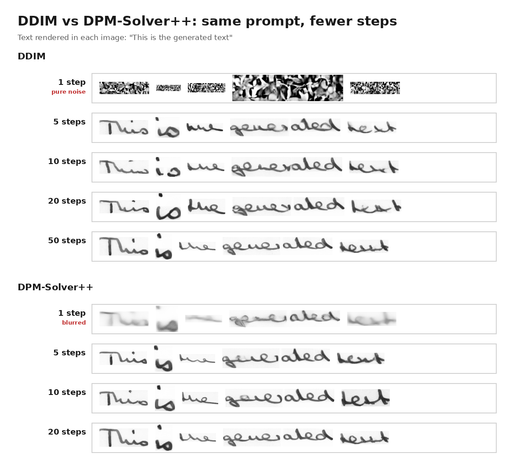

# 🔥 DiffusionPen: Handwritten Text Generation (extended fork)

> **This is a fork of [koninik/DiffusionPen](https://github.com/koninik/DiffusionPen)** by Konstantina Nikolaidou, George Retsinas, Giorgos Sfikas and Marcus Liwicki, the official code for the ECCV 2024 paper *DiffusionPen: Towards Controlling the Style of Handwritten Text Generation*.
> All credit for the model, the training code and the pretrained weights goes to the original authors. This fork builds on their work with a faster sampler and an easier-to-use sampling interface. If you use this code, please [cite the original paper](#-citation).

 <p align='center'>
  <b>
    <a href="https://www.ecva.net/papers/eccv_2024/papers_ECCV/html/11492_ECCV_2024_paper.php">ECCV Paper</a>
    |
    <a href="http://www.arxiv.org/abs/2409.06065">ArXiv</a>
    |
    <a href="https://drive.google.com/file/d/1BXHPPpjD84mhdYUnnHeXCc-A-3tWhkaR/view?usp=share_link">Poster</a>
    |
    <a href="https://huggingface.co/konnik/DiffusionPen">Hugging Face</a>
    |
    <a href="https://github.com/koninik/DiffusionPen">Original repo</a>
  </b>
</p>

## ✨ What's new in this fork

**Faster sampling with DPM-Solver++**
- New `--scheduler dpm` option uses `DPMSolverMultistepScheduler` (DPM-Solver++, 2nd order). It gives results on par with DDIM in **20 steps instead of 50**.
- New `--sampling_steps` flag sets the number of denoising steps. The default is 50 for DDIM and 20 for DPM.
- No retraining needed. Both schedulers use the same Stable Diffusion v1.5 noise schedule, so the original weights work as-is.

<p align="center">
  
</p>

Both samplers were run with the same text, the same style (writer 12) and the same model weights, at different step counts:
- **DPM-Solver++ at 20 steps looks almost the same as DDIM at 50 steps.**
- **At very low step counts, DPM-Solver++ degrades much more gracefully.** With 1 step, DDIM produces pure noise while DPM-Solver++ already gives blurry but readable words. At 5–10 steps, DPM-Solver++ is already readable.

**Command-line control over sampling.** Before, the text and style were hard-coded in `train.py`. Now you can set them with flags:
- `--text`: the word(s) or paragraph to generate.
- `--style`: which IAM writer style to copy (index 0–338).
- `--seed`: makes results reproducible.
- `--output_dir`: where outputs go. Single words are saved to `<output_dir>/single/`, paragraphs to `<output_dir>/paragraph/`. File names include the word, the style and the sampler, e.g. `hello_style_12_dpm20.png`.

**Fixes and quality of life**
- Runs on CPU when no GPU is found: `--device` defaults to `cpu` and checkpoints load with `map_location`.
- Sampling no longer loads the full IAM training dataset, so it starts faster.
- `wandb` is only needed when `--wandb_log True` is set.
- Fixed a crash in paragraph mode (`punctuation` was undefined) and an invalid `clip_model` argument.
- Single-word sampling now saves one file per word (the `save_single_images` helper was missing).

## 📢 Introduction (from the original authors)
- DiffusionPen is a few-shot diffusion model for generating stylized handwritten text. From just a few reference samples (as few as five), it learns a writer's handwriting style and generates new text that imitates it.
- It captures both seen and unseen handwriting styles from few examples. This is done with a style extraction module that combines metric learning and classification.
- It was evaluated on the IAM and GNHK (qualitative only) handwriting datasets. The generated data closely matches the real handwriting distribution and improves Handwriting Text Recognition (HTR) systems when used for training.

<p align="center">
  
</p>

<p align="center">
  Overview of the proposed DiffusionPen
</p>

## 🚀 Setup

Datasets and model weights are **not included in this repository**. Download them from the original authors' Hugging Face page: <a href="https://huggingface.co/konnik/DiffusionPen">https://huggingface.co/konnik/DiffusionPen</a>

- IAM pre-processed dataset in .pt, for direct loading: <a href="https://huggingface.co/konnik/DiffusionPen/tree/main/saved_iam_data">saved_iam_data</a>
- Style encoder weights (including DiffusionPen-class and DiffusionPen-triplet): <a href="https://huggingface.co/konnik/DiffusionPen/tree/main/style_models">style_models</a>
- DiffusionPen weights for IAM: <a href="https://huggingface.co/konnik/DiffusionPen/tree/main/diffusionpen_iam_model_path/models">diffusionpen_iam_model_path/models</a>
- VAE and noise scheduler config: <a href="https://huggingface.co/stable-diffusion-v1-5/stable-diffusion-v1-5">stable-diffusion-v1-5</a>
- IAM word images (`iam_data/words/`): sampling uses them as style references. Get them from the [IAM Handwriting Database](https://fki.tic.heia-fr.ch/databases/iam-handwriting-database) (registration required).

Place them in the main code directory like this:

```
DiffusionPen/
├── diffusionpen_iam_model_path/models/{ckpt.pt, ema_ckpt.pt}
├── style_models/iam_style_diffusionpen.pth
├── stable-diffusion-v1-5/{vae/, scheduler/}
├── iam_data/words/...
└── saved_iam_data/        # only needed for training
```

## 🧪 Sampling

**Single words.** Each space-separated word becomes its own image:
```
python train.py --train_mode sampling --sampling_mode single_sampling --text "hello world" --style 12 --scheduler dpm
```

**Paragraph.** The whole text is written in one style:
```
python train.py --train_mode sampling --sampling_mode paragraph --text "In this work , we focus on style variation ." --style 12 --scheduler dpm
```
Put spaces around punctuation (`word , word .`). The paragraph is split on spaces, and stand-alone punctuation is laid out separately.

**Full command with every sampling flag:**
```
python train.py --train_mode sampling --sampling_mode paragraph --text "your text here ." --style 12 --scheduler dpm --sampling_steps 20 --seed 42 --output_dir ./image_samples --save_path ./diffusionpen_iam_model_path --style_path ./style_models/iam_style_diffusionpen.pth --stable_dif_path ./stable-diffusion-v1-5 --device cuda:0
```

| Flag | Default | Description |
|---|---|---|
| `--sampling_mode` | `single_sampling` | `single_sampling` (one image per word) or `paragraph` |
| `--text` | built-in demo text | Words or paragraph to generate |
| `--style` | random (single), `12` (paragraph) | IAM writer style index, 0–338. Mapped to writer IDs in `writers_dict_train.json` |
| `--scheduler` | `ddim` | `ddim` or `dpm` (DPM-Solver++) |
| `--sampling_steps` | 50 (ddim) / 20 (dpm) | Number of denoising steps |
| `--seed` | none | Random seed for reproducible outputs |
| `--output_dir` | `./image_samples` | Output folder |
| `--device` | `cuda:0` if available, else `cpu` | Device to run on |

> **Note:** Do not pass the boolean flags (`--latent`, `--img_feat`, `--color`, ...) on the command line. They use argparse `type=bool`, so even `False` is read as `True`. Their defaults are already correct for sampling.

The original authors also provide the IAM training and validation set images generated with **DiffusionPen**:
[Download IAM Dataset Generated with DiffusionPen](https://drive.google.com/file/d/1IcQLZ8yIqdLgYyZUsFOl3v8qYN3h2RJL/view?usp=share_link)

## 🏋️‍♂️ Train with Your Own Data

To train DiffusionPen on your own data, adjust the data loader to fit your dataset and follow these 2 steps:

1. Train the Style Encoder:
```
python style_encoder_train.py
```
2. Train DiffusionPen:
```
python train.py --epochs 1000 --model_name diffusionpen --save_path /new/path/to/save/models --style_path /new/path/to/style/model.pth --stable_dif_path ./stable-diffusion-v1-5
```

## 📝 Evaluation

### Evaluation script (this fork)

`eval.py` measures two things:
- **Legibility:** CER (character error rate) and word accuracy, read by [TrOCR](https://huggingface.co/microsoft/trocr-base-handwritten).
- **Style fidelity:** [HWD (Handwriting Distance)](https://github.com/aimagelab/HWD) (Pippi et al., BMVC 2023), computed between generated words and the writer's real handwriting.

**How it works:** the script picks IAM writers. By default these are *unseen test writers*, so this is a real few-shot test. For each writer it:
1. Takes 5 of their words as style references.
2. Generates other words that same writer actually wrote.
3. Scores the generated words against the writer's real images of those same words.

**Setup** (one time):
```
pip install git+https://github.com/aimagelab/HWD.git gudhi matplotlib
```

**Compare samplers.** Runs in the same `--out_dir` reuse the same writers, references and initial noise, so they are directly comparable:
```
python eval.py --scheduler ddim --sampling_steps 50
python eval.py --scheduler dpm --sampling_steps 20
```
After each run, a comparison table of all runs in that folder is printed:

| Column | Meaning | Better |
|---|---|---|
| HWD (style) | Distance between generated and real handwriting features, averaged per writer | lower |
| CER | Raw TrOCR character error rate | lower |
| CER norm | CER ignoring case, punctuation and spaces. TrOCR is a line model and often appends " ." to single words, so this is the fairer number. | lower |
| word acc | Share of words read exactly right, after the same normalization | higher |
| sec/word | Generation time per word | lower |
| `real (ref.)` row | HWD between two separate sets of each writer's real words (the score real handwriting from the same writer gets, a reference level), and TrOCR's CER on real words (the OCR ceiling) | — |

**Useful flags:**
- `--split train` evaluates writers seen during training.
- `--num_writers` / `--words_per_writer` set the sample size (default 10 × 20).
- `--skip_generation` re-scores existing images without generating again.
- `--fid` adds FID. It is only meaningful with many images.
- Generated images, OCR predictions and `results_<tag>.json` are saved in `--out_dir`, by default `./eval_runs/iam_test`.

### Original paper

The original paper compares **DiffusionPen** with several state-of-the-art generative models, including [GANwriting](https://github.com/omni-us/research-GANwriting), [SmartPatch](https://github.com/MattAlexMiracle/SmartPatch), [VATr](https://github.com/aimagelab/VATr), and [WordStylist](https://github.com/koninik/WordStylist).
The Handwriting Text Recognition (HTR) system used for evaluation is based on [Best practices for HTR](https://github.com/georgeretsi/HTR-best-practices).

## 🗺️ Roadmap

- [x] DPM-Solver++ sampler (20 steps)
- [x] CLI control of text, style, seed and output folder
- [x] Evaluation script: HWD (style) + TrOCR CER (legibility)
- [ ] Few-shot style from your own handwriting photos (`--style_images`)
- [ ] Consistent style references across a paragraph, plus batched word generation
- [ ] Baseline-aligned, more natural paragraph layout
- [ ] OCR-based selection of the most legible sample
- [ ] Gradio web demo

---

## 📄 Citation

This fork is based entirely on the work of the original authors. If you find it useful, please cite their paper:

```bibtex
@article{nikolaidou2024diffusionpen,
  title={DiffusionPen: Towards Controlling the Style of Handwritten Text Generation},
  author={Nikolaidou, Konstantina and Retsinas, George and Sfikas, Giorgos and Liwicki, Marcus},
  journal={arXiv preprint arXiv:2409.06065},
  year={2024}
}
```

## 📜 License

MIT, same as the original repository. Copyright (c) 2024 Konstantina Nikolaidou. See [LICENSE](LICENSE).
